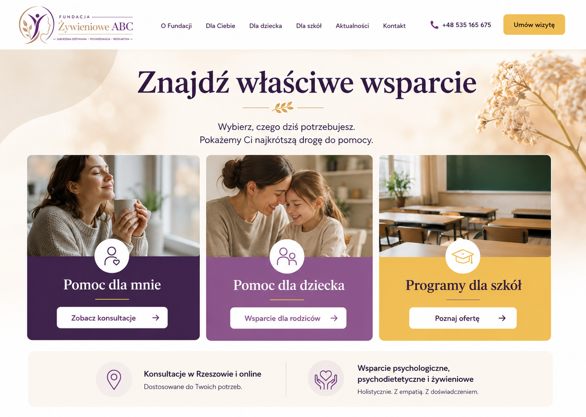

# Strona Fundacji Żywieniowe ABC

**Stan: koncepcja interfejsu.**

Koncepcja przebudowy strony: wybór obszaru wsparcia, oferta i czytelna nawigacja. Nie odnaleziono paczki implementacji tej makiety.

## Mój udział

Przygotowanie kierunku wizualnego z pomocą AI i określenie potrzeb strony/aplikacji. Obraz pokazuje propozycję projektu, nie wdrożenie.

## Dalszy etap

Implementacja interfejsu, uzupełnienie prawdziwych treści i weryfikacja działania.
