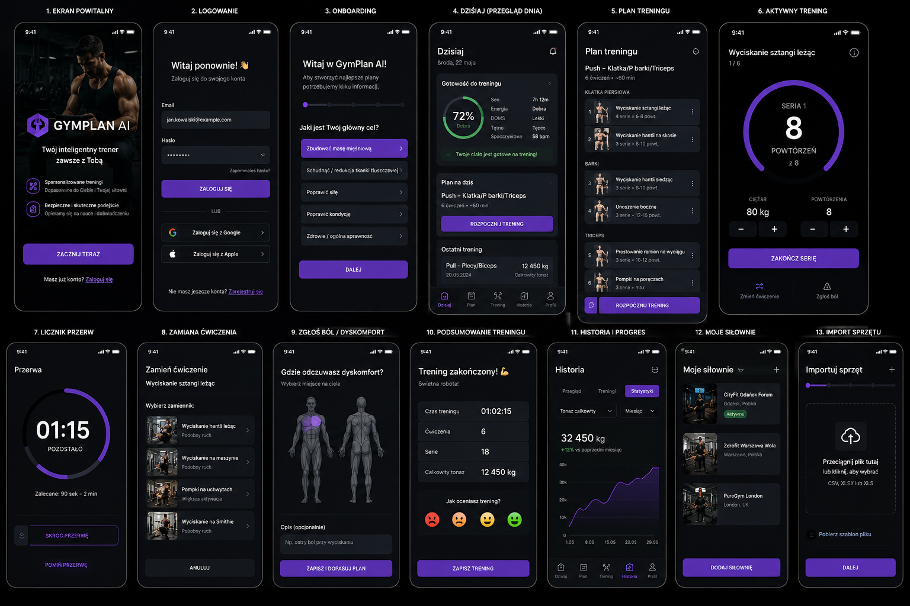

# GymPlan AI / Trening Siłownia

PWA treningowa, profil, siłownie, sprzęt, baza ćwiczeń.

**Stan:** Dokumentacja i fundament Next.js/Prisma. Paczka wymaga instalacji zależności i sprawdzenia; generator treningów niepotwierdzony jako gotowy.

## Problem i rozwiązanie

PWA treningowa, profil, siłownie, sprzęt, baza ćwiczeń.

## Mój udział

Określanie wymagań i procesu, rozwijanie projektu z pomocą AI, praca z kolejnymi wersjami oraz dopracowywanie rozwiązania. Zakres wykonania opisuje stan powyżej; funkcje zaplanowane nie są przedstawiane jako gotowe.

## Materiały publiczne

Ten opis przedstawia zakres projektu. Pełne źródła i konfiguracja wdrożenia pozostają poza publicznym portfolio.

## Projekt interfejsu

To makieta kierunku wizualnego, nie zrzut ukończonej aplikacji.

## Weryfikacja i dalszy rozwój

Stan projektu opisany powyżej odróżnia istniejącą implementację od planowanych funkcji. Pełne testy integracyjne i bezpieczeństwa nie są potwierdzone przez tę prezentację.
