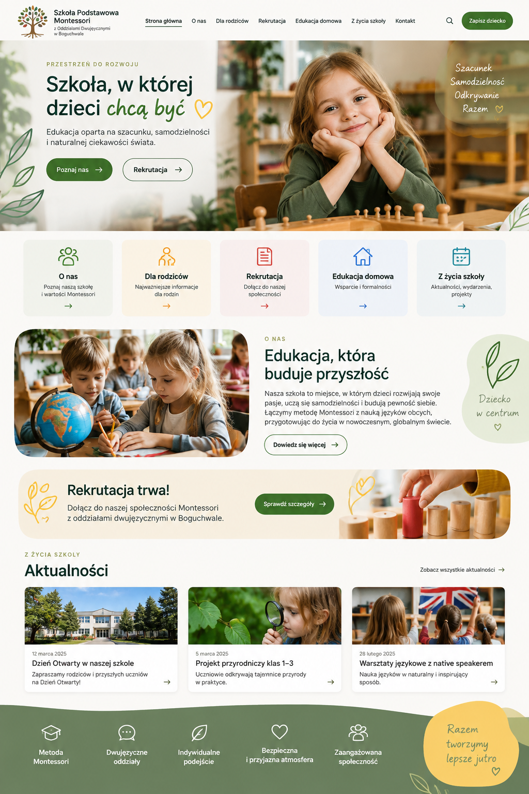

# Montessori w Boguchwale — nowa strona

**Stan: koncepcja interfejsu.**

Koncepcja nowej szaty strony szkoły: rekrutacja, sekcje dla rodziców i aktualności. To propozycja wizualna, nie ukończona strona ani zlecenie potwierdzone przez szkołę.

## Mój udział

Przygotowanie kierunku wizualnego z pomocą AI i określenie potrzeb strony/aplikacji. Obraz pokazuje propozycję projektu, nie wdrożenie.

## Dalszy etap

Implementacja interfejsu, uzupełnienie prawdziwych treści i weryfikacja działania.
