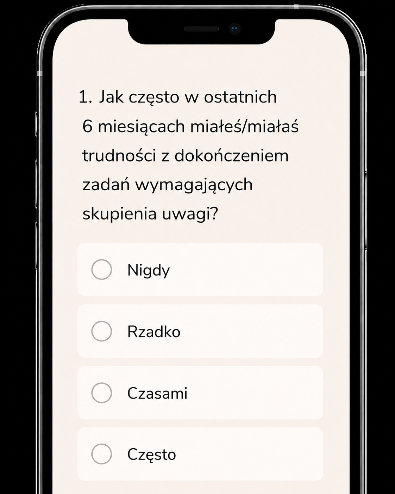

# Aplikacja do badania uwagi

**Stan: koncepcja interfejsu.**

Makieta mobilnego formularza z pytaniem i odpowiedziami. Nie odnaleziono osobnego kodu aplikacji.

## Mój udział

Przygotowanie kierunku wizualnego z pomocą AI i określenie potrzeb strony/aplikacji. Obraz pokazuje propozycję projektu, nie wdrożenie.

## Dalszy etap

Implementacja interfejsu, uzupełnienie prawdziwych treści i weryfikacja działania.
